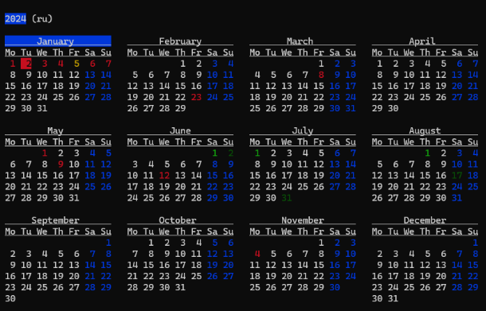

# ```ccal```

Calendar with local holidays via ip location

* Caches holidays and location in local cache folder



## Install

### Static binary
```bash
curl -LO https://github.com/inv2004/ccal/releases/latest/download/ccal \
&& chmod +x ccal \
&& mv ccal ~/bin/
```

### Arch/AUR
```bash
yay -S ttop
```

### Nimble
```bash
nimble install ccal
```

## Usage
```bash
Usage:
ccal [year(s)] [country]   year (or several) and country code
     [country] [year(s)]
     --cleanup             cleanup holidays cache
     --version -v          version
```
