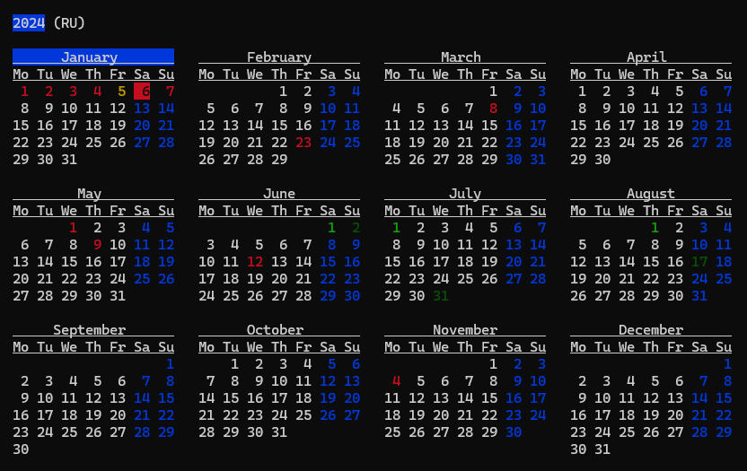

# ```ccal```

Calendar with local holidays via ip location

* Caches holidays and location in local cache folder

## Install
```bash
nimble install ccal
```



## Usage
```bash
Usage:
ccal [year(s)] [country]   year (or several) and country code
     [country] [year(s)]
     --cleanup             cleanup holidays cache
     --version -v          version
```
